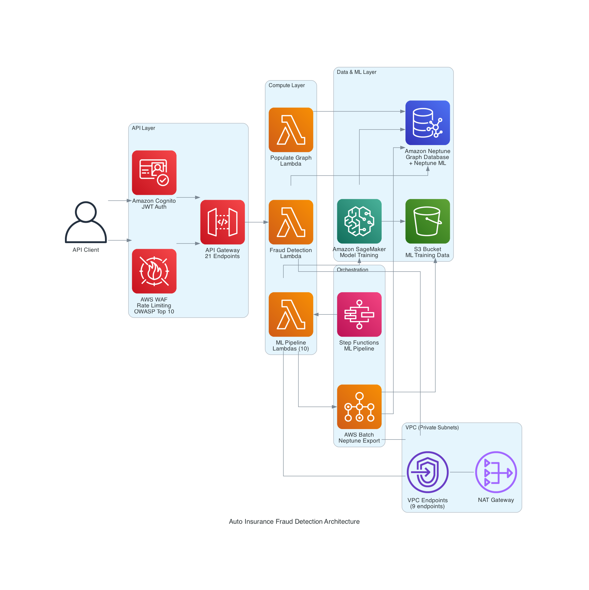

[](README.md)<br />
[](README.pt-br.md)

# Detección de Fraude en Seguros de Auto con Amazon Neptune ML

Esta solución demuestra la detección de fraude en seguros de auto usando Amazon Neptune ML para identificar anillos de colisión, talleres sospechosos y testigos profesionales.

## Inicio Rápido

Despliegue el sistema completo de detección de fraude en **3 simples pasos**:

```bash
# 1. Navegue al directorio
cd auto-insurance-fraud-detection

# 2. (Opcional) Configure su región y perfil de AWS
export AWS_REGION=us-east-1  # Por defecto: us-east-1
export AWS_PROFILE=default   # Por defecto: default

# 3. Ejecute el script de despliegue
./scripts/deploy.sh
```

**¡Eso es todo!** El script toma ~16 minutos y despliega todo automáticamente usando stacks anidados de CloudFormation.

### Lo Que Obtienes

Después de completar el despliegue, tendrás:
- ✅ API de detección de fraude completamente operativa con 22 endpoints
- ✅ **Autenticación Cognito** - Control de acceso seguro basado en JWT con cookies httpOnly
- ✅ **Aplicación web frontend** - Panel interactivo de detección de fraude con almacenamiento seguro de tokens
- ✅ **Protección WAF** - Limitación de tasa, OWASP Top 10, protección contra inyección SQL
- ✅ **Soporte completo de CORS** - Todos los endpoints tienen métodos OPTIONS configurados
- ✅ **Autenticación IAM de Neptune** - Acceso a base de datos vía credenciales IAM (sin contraseñas)
- ✅ **Seguridad Lambda** - Concurrencia reservada y registro estructurado con Powertools
- ✅ **Encabezados de Seguridad CloudFront** - Protección HSTS, CSP, X-Frame-Options
- ✅ Base de datos de grafos Neptune con 2000 reclamos de seguros de muestra
- ✅ 14 funciones Lambda para detección de fraude, entrenamiento ML y autenticación
- ✅ API Gateway con validación de solicitudes y endpoints autenticados
- ✅ Pipeline de entrenamiento ML con Step Functions
- ✅ **Cero acceso a internet desde VPC** - Todo el tráfico vía endpoints VPC

### Autenticación Requerida

Todos los endpoints de la API requieren autenticación. Cree un usuario en Cognito:

```bash
# Crear usuario
aws cognito-idp admin-create-user \
  --user-pool-id <USER_POOL_ID> \
  --username usuario@empresa.com \
  --message-action SUPPRESS

# Establecer contraseña permanente
aws cognito-idp admin-set-user-password \
  --user-pool-id <USER_POOL_ID> \
  --username usuario@empresa.com \
  --password TuContraseña123! \
  --permanent
```

O use la página de inicio de sesión del frontend en `frontend/login.html`.

# Llamar a la API con el token
curl -H "Authorization: Bearer $AUTH_TOKEN" \
  https://TU-API-ENDPOINT/prod/analytics/fraud-trends
```

**Opciones del Script:**
```bash
./scripts/authenticate.sh [OPCIONES]

Opciones:
  -u, --username <email>    Email del usuario (requerido)
  -p, --password <pass>     Contraseña del usuario (opcional, genera aleatoria si no se proporciona)
  --region <region>         Región de AWS (por defecto: $AWS_REGION o us-east-1)
  --profile <profile>       Perfil de AWS (por defecto: $AWS_PROFILE o default)
  --output <file>           Archivo de salida del token (por defecto: .auth-token)
  --create-only             Solo crear usuario, no autenticar
  --token-only              Solo obtener token para usuario existente
  -h, --help                Mostrar mensaje de ayuda
```

**Ejemplos:**
```bash
# Solo crear usuario sin autenticar
./scripts/authenticate.sh -u usuario@empresa.com -p MiPass123! --create-only

# Obtener token para usuario existente
./scripts/authenticate.sh -u usuario@empresa.com -p MiPass123! --token-only

# Usar en región diferente
./scripts/authenticate.sh -u usuario@empresa.com --region eu-west-1
```

## Arquitectura

Esta solución usa una **arquitectura modular de stacks anidados** con seguridad de nivel empresarial:

**Servicios Principales:**
- **Amazon Neptune** - Base de datos de grafos almacenando reclamos, reclamantes, vehículos, accidentes, talleres y testigos (con autenticación IAM)
- **Neptune ML** - Modelo de Red Neuronal de Grafos (GNN) para predicción de fraude
- **AWS Lambda** - 14 funciones serverless para API, población de datos y pipeline ML (con concurrencia reservada)
- **AWS Step Functions** - Orquestación del pipeline de entrenamiento ML
- **Amazon API Gateway** - API REST con 22 endpoints autenticados y validación de solicitudes
- **AWS Batch** - Trabajos de exportación de datos de Neptune (con autenticación IAM)
- **Amazon S3** - Almacenamiento de datos de entrenamiento ML y modelos
- **Amazon SageMaker** - Entrenamiento de modelos ML y endpoints de inferencia
- **Amazon CloudFront** - Entrega de contenido con encabezados de seguridad

**Seguridad y Autenticación:**
- **Amazon Cognito** - Autenticación de usuarios con tokens JWT y cookies httpOnly
- **AWS WAF** - Firewall de aplicaciones web con limitación de tasa y protección OWASP Top 10
- **VPC Endpoints** - Sin acceso a internet desde VPC, todo el tráfico vía endpoints privados (12 endpoints)
- **Security Groups** - Acceso de red con mínimo privilegio
- **Autenticación IAM** - Neptune y Lambda usan credenciales IAM
- **Encabezados de Seguridad CloudFront** - HSTS, CSP, X-Frame-Options, X-Content-Type-Options

**Infraestructura:** 11 stacks anidados de CloudFormation para modularidad y mantenibilidad



Vea [SAMPLE_QUERIES.md](SAMPLE_QUERIES.md) para ejemplos de consultas de detección de fraude.

## Características de Seguridad

### Seguridad de Nivel Empresarial (11 Mejoras Implementadas)

Esta solución implementa mejores prácticas de seguridad integrales:

**1. Autenticación y Autorización**
- **Amazon Cognito** - Autenticación basada en JWT para todos los endpoints de la API
- **Autenticación IAM de Base de Datos** - Neptune usa credenciales IAM (sin contraseñas de base de datos)
- **Almacenamiento Seguro de Tokens** - Tokens almacenados en memoria con respaldo de cookies httpOnly
- **Validez de Tokens** - 1 hora (ID/Acceso), 30 días (Actualización)
- **Política de Contraseñas Fuertes** - Aplicada por Cognito

**2. Seguridad de API**
- **Validación de Solicitudes** - API Gateway valida todos los cuerpos de solicitudes POST
- **Límites de Tamaño de Solicitud** - Previene cargas útiles de gran tamaño
- **Configuración CORS** - Configurada correctamente para acceso del frontend
- **Limitación de Tasa** - 2,000 solicitudes por 5 minutos por IP (WAF)

**3. Firewall de Aplicaciones Web (WAF)**
- **Protección OWASP Top 10** - XSS, CSRF, inyección SQL
- **Detección de Bots** - Bloquea solicitudes sin User-Agent
- **Registro de Solicitudes** - Retención de 30 días en CloudWatch

**4. Seguridad de Red**
- **Cero Acceso a Internet** - Todos los recursos en subredes privadas
- **VPC Endpoints** - Conectividad privada a servicios de AWS (12 endpoints)
- **Security Groups** - Reglas de acceso con mínimo privilegio
- **Cifrado** - TLS en tránsito, cifrado en reposo

**5. Seguridad Lambda**
- **Concurrencia Reservada** - 50 ejecuciones concurrentes por función (previene agotamiento de recursos)
- **AWS Lambda Powertools** - Registro estructurado para todas las funciones
- **IAM de Mínimo Privilegio** - Roles IAM específicos por función

**6. Seguridad del Frontend**
- **Encabezados de Seguridad CloudFront** - HSTS, CSP, X-Frame-Options, X-Content-Type-Options
- **Manejo Seguro de Cookies** - Cookies httpOnly para almacenamiento de tokens
- **Endpoint de Cierre de Sesión** - Terminación adecuada de sesión

**7. Seguridad de Infraestructura**
- **Sin Credenciales Codificadas** - Todas las contraseñas usan Secrets Manager o marcadores de parámetros
- **Salidas de CloudFormation** - Configuración del frontend auto-generada desde salidas del stack
- **Despliegue Automatizado** - Reduce errores de configuración manual

## Despliegue

### Despliegue Automatizado (Recomendado)

La forma más fácil de desplegar es usando el script proporcionado:

```bash
./scripts/deploy.sh
```

**Lo que hace el script:**
1. Despliega el stack de CloudFormation (~15-20 minutos)
2. Despliega todo el código de funciones Lambda (~1 minuto)
3. Puebla Neptune con 200 reclamos de muestra (~5 segundos)
4. **Inicia el pipeline de entrenamiento ML** (~1-2 horas en segundo plano)
5. Proporciona el endpoint de la API y resumen del despliegue

**Tiempo total de despliegue: ~16 minutos**  
**Tiempo de entrenamiento ML: 1-2 horas (se ejecuta en segundo plano)**

**Importante:** Después de completar el despliegue:
- ✅ 9 endpoints de algoritmos de grafos funcionan inmediatamente
- ⏳ 5 endpoints potenciados por ML estarán disponibles después de completar el entrenamiento (1-2 horas)

### Opciones de Configuración

Configure variables de entorno antes de ejecutar el script:

```bash
# Desplegar en una región diferente
export AWS_REGION=us-east-2

# Usar un perfil específico de AWS
export AWS_PROFILE=mi-perfil

# Luego desplegar
./scripts/deploy.sh
```

### Prerrequisitos

- AWS CLI configurado con credenciales apropiadas
- Permisos para crear stacks de CloudFormation, funciones Lambda, clusters Neptune, VPCs, User Pools de Cognito
- ~20 minutos para el despliegue

### Limpieza

Para eliminar todos los recursos desplegados:

```bash
./scripts/undeploy.sh
```

### Actualización para Producción

La configuración por defecto usa **db.t3.medium** para rentabilidad (~$195/mes). Para cargas de trabajo de producción:

```bash
# Desplegar con instancia Neptune de grado de producción
aws cloudformation update-stack \
  --stack-name auto-insurance-fraud-detection \
  --use-previous-template \
  --parameters ParameterKey=NeptuneInstanceClass,ParameterValue=db.r5.large \
  --capabilities CAPABILITY_NAMED_IAM
```

**¿Por qué actualizar?**
- db.t3.medium usa créditos de CPU (puede limitarse bajo carga sostenida)
- db.r5.large proporciona rendimiento consistente
- Mejor para cargas de trabajo de entrenamiento ML
- Costo: +$280/mes (~$475/mes total)

## Lo Que Se Despliega

**Infraestructura (11 Stacks Anidados):**
- Cluster Amazon Neptune (db.t3.medium) con ML habilitado y autenticación IAM
- User Pool de Amazon Cognito para autenticación
- AWS WAF con 5 reglas de protección
- VPC con subredes privadas y 12 endpoints VPC
- 14 funciones AWS Lambda (con concurrencia reservada y registro Powertools)
- API Gateway con autorizador JWT, validación de solicitudes y 22 endpoints (incluyendo logout)
- Pipeline de entrenamiento ML con Step Functions
- AWS Batch para exportación de Neptune (con autenticación IAM)
- Bucket S3 para Neptune ML (con políticas de ciclo de vida)
- Roles IAM con políticas de mínimo privilegio
- Security groups con reglas inline
- Distribución CloudFront con encabezados de seguridad

**Datos de Muestra:**
- 1.000 reclamantes
- 1.500 vehículos
- 200 talleres de reparación (10% sospechosos)
- 150 proveedores médicos (13% sospechosos)
- 300 testigos (20% profesionales)
- 250 abogados (20% corruptos)
- 200 compañías de grúa (20% corruptas)
- 2.000 reclamos de seguros (40% fraudulentos)
- Pasajeros variables (pasajeros falsos en reclamos fraudulentos)

## Endpoints de la API (22 en Total)

Todos los endpoints requieren autenticación JWT vía encabezado `Authorization: Bearer <token>`.

### Autenticación (2 endpoints)
- `POST /auth/login` - Autenticar usuario y obtener token JWT
- `POST /auth/logout` - Cerrar sesión y limpiar sesión

### Gestión de Reclamos (6 endpoints)
- `POST /claims` - Enviar reclamo con detección de fraude ML
- `GET /claims/{claim_id}` - Obtener detalles del reclamo
- `GET /claimants/{claimant_id}/claims` - Obtener historial de reclamos del reclamante
- `GET /claimants/{claimant_id}/risk-score` - Obtener puntuación de riesgo potenciada por ML
- `GET /claimants/{claimant_id}/claim-velocity` - Analizar frecuencia de reclamos
- `GET /claimants/{claimant_id}/fraud-analysis` - Análisis integral de fraude

### Patrones de Fraude (4 endpoints)
- `GET /fraud-patterns/collision-rings` - Detectar 6 tipos de fraude de anillos de colisión (accidentes escenificados, swoop & squat, pasajeros falsos, colisiones de papel, abogados corruptos, compañías de grúa corruptas)
- `GET /fraud-patterns/professional-witnesses` - Encontrar testigos repetidos
- `GET /fraud-patterns/collusion-indicators` - Identificar colusión
- `GET /fraud-patterns/cross-claim-patterns` - Fraude entre reclamos

### Redes de Fraude (4 endpoints)
- `GET /fraud-networks/influential-claimants` - Encontrar centros de red
- `GET /fraud-networks/organized-rings` - Detectar fraude organizado
- `GET /fraud-networks/connections` - Mapear conexiones de estafadores
- `GET /fraud-networks/isolated-rings` - Encontrar grupos de fraude aislados

### Analítica (4 endpoints)
- `GET /analytics/fraud-trends` - Tendencias de fraude a lo largo del tiempo
- `GET /analytics/geographic-hotspots` - Concentración geográfica de fraude
- `GET /analytics/claim-amount-anomalies` - Detección de anomalías potenciada por ML
- `GET /analytics/temporal-patterns` - Patrones de fraude basados en tiempo

### Análisis de Entidades (3 endpoints)
- `GET /repair-shops/{shop_id}/statistics` - Estadísticas de fraude del taller
- `GET /repair-shops/fraud-hubs` - Identificar talleres centro de fraude
- `GET /vehicles/{vehicle_id}/fraud-history` - Historial de fraude del vehículo
- `GET /medical-providers/{provider_id}/fraud-analysis` - Análisis de fraude del proveedor

## Capacidades de Detección de Fraude

El sistema detecta 16 tipos de fraude de seguros usando algoritmos de grafos y ML:

**Patrones de Anillos de Colisión (6 tipos):**
1. **Accidentes Escenificados** - Reclamantes compartiendo vehículos, testigos y talleres
2. **Swoop & Squat** - Maniobras de colisión trasera dirigidas a víctimas
3. **Pasajeros Falsos** - Jump-ins reclamando lesiones falsas
4. **Colisiones de Papel** - Accidentes fantasma con reportes policiales no verificados
5. **Abogados Corruptos** - Bufetes de abogados dirigiendo clientes a anillos de fraude
6. **Compañías de Grúa Corruptas** - Operadores de grúa dirigiendo víctimas a talleres fraudulentos

**Patrones de Fraude de Red (7 tipos):**
7. **Testigos Profesionales** - Mismo testigo en múltiples reclamos no relacionados
8. **Anillos de Fraude Organizados** - Redes de fraude densamente conectadas
9. **Talleres Centro de Fraude** - Talleres conectando múltiples anillos
10. **Triángulos de Colusión** - Esquemas de fraude de tres vías
11. **Anillos Aislados** - Operaciones de fraude independientes
12. **Fraude de Proveedores Médicos** - Esquemas de facturación inflada
13. **Patrones Entre Reclamos** - Relaciones de fraude habituales

**Patrones de Analítica y ML (3 tipos):**
14. **Velocidad de Reclamos** - Presentadores de reclamos en serie
15. **Puntos Calientes Geográficos** - Concentración regional de fraude
16. **Anomalías de Monto de Reclamos** - Montos de reclamos inflados detectados por ML

Vea [API_DOCUMENTATION.md](API_DOCUMENTATION.md) para documentación detallada de endpoints.

## Modelo de Grafos

### Vértices
- **Claimant** - Titulares de pólizas de seguros
- **Vehicle** - Vehículos asegurados (vin, make, year, plate, ownerId)
- **Claim** - Reclamos de seguros (con fraudScore)
- **Accident** - Eventos de accidentes (con accidentType, maneuverType, policeVerified)
- **RepairShop** - Instalaciones de reparación de autos (con fraudScore)
- **MedicalProvider** - Proveedores de atención médica (con fraudScore)
- **Witness** - Testigos de accidentes (con fraudScore)
- **Attorney** - Representantes legales (con fraudScore)
- **TowCompany** - Operadores de grúas (con fraudScore)
- **Passenger** - Pasajeros de accidentes (con fraudScore)

### Aristas
- **owns** - Reclamante posee Vehículo
- **filed_claim** - Reclamante presentó Reclamo
- **for_accident** - Reclamo por Accidente
- **involved_vehicle** - Accidente involucró Vehículo
- **repaired_at** - Reclamo reparado en Taller
- **treated_by** - Reclamante o Pasajero tratado por Proveedor Médico
- **witnessed_by** - Accidente presenciado por Testigo
- **represented_by** - Reclamante representado por Abogado
- **towed_by** - Vehículo remolcado por Compañía de Grúa
- **passenger_in** - Pasajero en Accidente
- **claimed_injury** - Pasajero reclamó lesión en Reclamo

## Uso de la API

Después del despliegue, use el endpoint de la API para detectar fraude:

```bash
# Obtener endpoint de la API de la salida del despliegue
API_ENDPOINT="https://TU-API-ENDPOINT/prod"

# Obtener tendencias de fraude
curl $API_ENDPOINT/analytics/fraud-trends

# Detectar anillos de colisión
curl $API_ENDPOINT/fraud-patterns/collision-rings

# Encontrar reclamantes influyentes
curl $API_ENDPOINT/fraud-networks/influential-claimants

# Analizar riesgo de reclamante específico
curl $API_ENDPOINT/claimants/{claimant-id}/risk-score
```

Vea [API_DOCUMENTATION.md](API_DOCUMENTATION.md) para todos los 21 endpoints con documentación detallada.

## Pipeline de Entrenamiento ML

El script de despliegue inicia automáticamente el pipeline de entrenamiento ML, que toma 1-2 horas en completarse.

**Monitorear el pipeline:**
```bash
# Obtener ARN de ejecución de la salida del despliegue, luego:
aws stepfunctions describe-execution \
  --execution-arn TU-EXECUTION-ARN \
  --region us-east-1
```

**¿Qué endpoints requieren entrenamiento ML?**
- ✅ **Funcionan inmediatamente** (Algoritmos de grafos - 9 endpoints): collision-rings, professional-witnesses, influential-claimants, organized-rings, fraud-hubs, connections, collusion-indicators, isolated-rings, cross-claim-patterns
- ⏳ **Disponibles después del entrenamiento** (Potenciados por ML - 5 endpoints): submit-claim (puntuación de fraude), risk-score, vehicle-fraud-history, medical-provider-fraud-analysis, claim-amount-anomalies

**Puede probar los endpoints de algoritmos de grafos inmediatamente. Los endpoints potenciados por ML estarán disponibles una vez que se complete el entrenamiento (~1-2 horas).**

El pipeline también se ejecuta automáticamente cada 15 días vía EventBridge para reentrenar modelos con nuevos datos de fraude.

## Limpieza

Para eliminar todos los recursos desplegados:

```bash
# Configure su región y perfil
export AWS_REGION=us-east-1
export AWS_PROFILE=default

# Ejecute el script de despliegue inverso
./scripts/undeploy.sh
```

El script maneja la limpieza de:
- Buckets S3 (incluyendo objetos versionados)
- Endpoints VPC (incluyendo endpoints administrados por GuardDuty)
- Interfaces de red (espera liberación)
- NAT Gateways
- Security groups
- Stack de CloudFormation y todos los recursos

## Estimación de Costos

Costos mensuales aproximados (us-east-1) con configuración por defecto:

**Cómputo y Base de Datos:**
- Neptune db.t3.medium: ~$70/mes (730 horas × $0.096/hora)
- Lambda (14 funciones): ~$5/mes (1M invocaciones, 512MB, 3s promedio)
- AWS Batch: ~$2/mes (trabajos de exportación mensuales)

**Redes:**
- VPC Endpoints (12): ~$84/mes (12 × $7/mes cada uno)
- CloudFront: ~$1/mes (primer 1TB gratis, luego $0.085/GB)

**API y Seguridad:**
- API Gateway: ~$3.50/1M solicitudes
- Cognito: Gratis (primeros 50K MAUs)
- WAF: ~$16/mes ($5 base + $1/regla × 5 + 10M solicitudes)

**Almacenamiento y ML:**
- Almacenamiento S3: ~$1/mes (datos Neptune ML)
- SageMaker: ~$2/mes (ml.m5.xlarge para entrenamiento, bajo demanda)
- CloudWatch Logs: ~$5/mes (5GB ingesta + retención)

**Total: ~$190/mes**

**Consejos de Optimización de Costos:**
- Use db.t3.medium para dev/test (~$70/mes)
- Actualice a db.r5.large para producción (~$350/mes) para rendimiento consistente
- Reduzca endpoints VPC si no se usan todos los servicios
- Ajuste concurrencia reservada de Lambda según carga real
- Use políticas de ciclo de vida S3 para archivar datos antiguos de entrenamiento ML

**Actualización de Producción:**
Para cargas de trabajo de producción, considere:
- Neptune db.r5.large: ~$350/mes (sin limitaciones de crédito de CPU)
- Costo total de producción: ~$480/mes

*Los costos varían por región y uso. El cluster Neptune es el principal impulsor de costos (~35% del total).*

## Ejemplo de Cliente Python

```python
import boto3
import requests

# Inicializar cliente Cognito
cognito = boto3.client('cognito-idp', region_name='us-east-1')

# Iniciar sesión
response = cognito.admin_initiate_auth(
    UserPoolId='TU_USER_POOL_ID',
    ClientId='TU_CLIENT_ID',
    AuthFlow='ADMIN_USER_PASSWORD_AUTH',
    AuthParameters={
        'USERNAME': 'usuario@empresa.com',
        'PASSWORD': 'ContraseñaSegura123!'
    }
)

token = response['AuthenticationResult']['IdToken']

# Llamar a la API de detección de fraude
headers = {'Authorization': f'Bearer {token}'}
response = requests.post(
    'https://TU-API/prod/claims',
    headers=headers,
    json={
        'claimAmount': 8500.00,
        'claimantId': 'claimant-12345',
        'vehicleId': 'vehicle-67890',
        'repairShopId': 'shop-abc123'
    }
)

print(f"Puntuación de Fraude: {response.json()['fraudScore']}")
```

## Documentación

- **[SAMPLE_QUERIES.md](SAMPLE_QUERIES.md)** - Ejemplos de consultas de detección de fraude
- **[API_DOCUMENTATION.md](API_DOCUMENTATION.md)** - Documentación detallada de endpoints
- **[infrastructure/README.md](infrastructure/README.md)** - Detalles de arquitectura de stacks anidados
- **[infrastructure/api-specs/](infrastructure/api-specs/)** - Especificación OpenAPI 3.0
- **[frontend/README.md](frontend/README.md)** - Guía de configuración y uso del frontend
- **[generated-diagrams/](generated-diagrams/)** - Visualizaciones de patrones de fraude:
  - `staged_accident_ring.png` - Anillos de fraude compartiendo vehículos, talleres y testigos
  - `swoop_and_squat.png` - Maniobras coordinadas de colisión trasera
  - `stuffed_passengers.png` - Pasajeros falsos (jump-ins) reclamando lesiones
  - `paper_collision.png` - Accidentes fantasma con documentación falsa
  - `corrupt_attorney.png` - Abogados dirigiendo clientes a anillos de fraude
  - `corrupt_tow_company.png` - Compañías de grúa dirigiendo víctimas a talleres fraudulentos
  - `collision_ring_patterns_overview.png` - Vista integral de los 6 patrones de anillos de colisión
  - Más 13 visualizaciones adicionales de patrones de fraude

## Soporte

Para problemas o preguntas:
1. Verifique la salida del despliegue para User Pool ID y Client ID de Cognito
2. Revise [SAMPLE_QUERIES.md](SAMPLE_QUERIES.md) para ejemplos de consultas
3. Verifique eventos del stack de CloudFormation para problemas de despliegue
4. Vea logs de API Gateway en CloudWatch: `/aws/apigateway/auto-insurance-fraud-detection-API`
5. Vea logs de WAF en CloudWatch: `/aws/wafv2/auto-insurance-fraud-detection-WAF`

## Licencia

Este código de muestra está disponible bajo la licencia MIT-0. Vea el archivo LICENSE.
