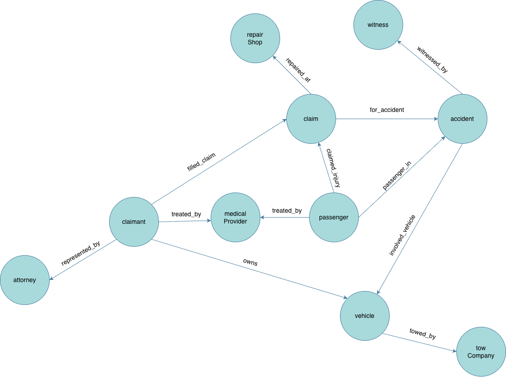
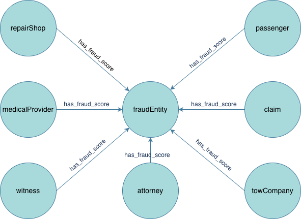
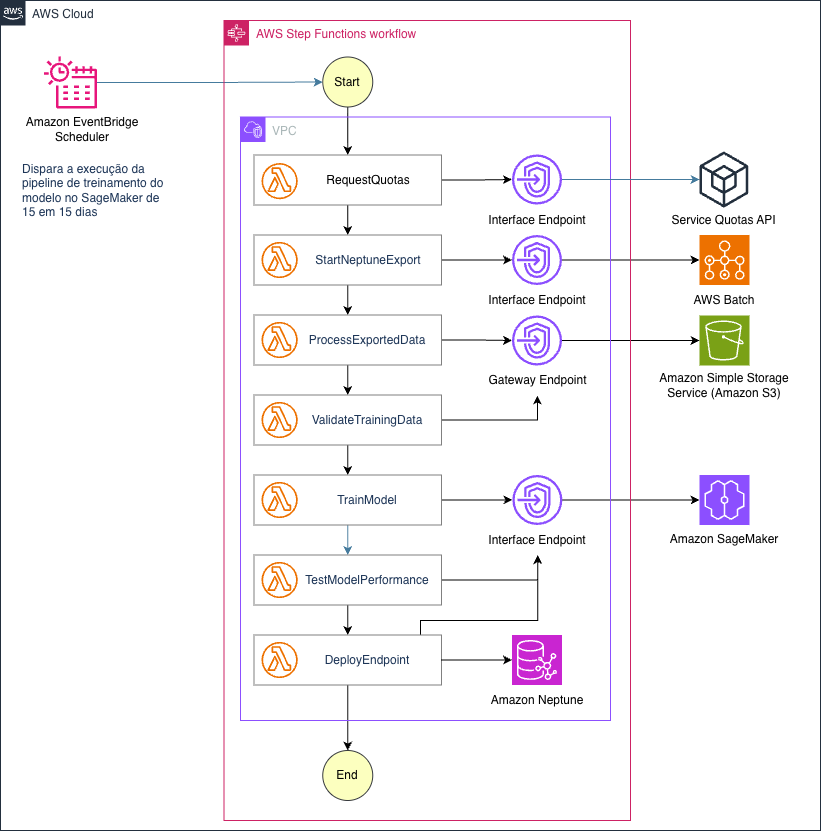

[](README.es-sp.md)<br />
[](README.pt-br.md)

# Auto Insurance Fraud Detection with Amazon Neptune ML

This solution demonstrates auto insurance fraud detection using Amazon Neptune ML to identify collision rings, suspicious repair shops, and professional witnesses.

## Quick Start

Deploy the complete fraud detection system in **3 steps**:

```bash
# 1. Navigate to the directory
cd auto-insurance-fraud-detection

# 2. (Optional) Set your AWS region and profile
export AWS_REGION=us-east-1  # Default: us-east-1
export AWS_PROFILE=default   # Default: default

# 3. Run the deployment script
./scripts/deploy.sh
```

> **Note:** The AWS profile used for deployment must have sufficient IAM permissions to create and manage resources such as VPCs, S3 buckets, IAM roles, Lambda functions, Neptune clusters, API Gateway, CloudFront distributions, Cognito user pools, and CloudFormation stacks. An IAM user or role with **AdministratorAccess** is recommended for the initial deployment. Since this level of access is highly permissive, consider creating a dedicated admin user for the deployment, and deleting it once `deploy.sh` completes.

**That's it!** The script takes ~16 minutes and deploys everything automatically using nested CloudFormation stacks.

### What You Get

After deployment completes, you'll have:
- ✅ Fully operational fraud detection API with 44 endpoints
- ✅ **Amazon Cognito authentication** - Secure JWT-based access control with httpOnly cookies
- ✅ **Frontend web application** - Interactive fraud detection dashboard with secure token storage
- ✅ **AWS WAF protection** - Rate limiting, OWASP Top 10, SQL injection protection
- ✅ **Full CORS support** - All endpoints have OPTIONS methods configured
- ✅ **Amazon Neptune IAM Authentication** - Database access via IAM credentials (no passwords)
- ✅ **AWS Lambda Security** - Reserved concurrency and structured logging with Powertools
- ✅ **Amazon CloudFront Security Headers** - HSTS, CSP, X-Frame-Options protection
- ✅ Amazon Neptune graph database with 2000 sample insurance claims
- ✅ 16 AWS Lambda functions for fraud detection, ML training, and authentication
- ✅ Amazon API Gateway with request validation and authenticated endpoints
- ✅ AWS Step Functions ML training pipeline
- ✅ **Zero internet access from VPC** - All traffic via VPC endpoints

All API endpoints require authentication. Use the `authenticate.sh` script to create a user and obtain a session cookie:

```bash
./scripts/authenticate.sh -u user@company.com -p YourPassword123!
```

```bash
# Call API with the saved cookie jar
curl -b .auth-cookie \
  https://YOUR-API-ENDPOINT/prod/analytics/fraud-trends
```

**Script Options:**
```bash
./scripts/authenticate.sh [OPTIONS]

Options:
  -u, --username <email>    User email (required)
  -p, --password <pass>     User password (optional, generates random if not provided)
  --region <region>         AWS region (default: $AWS_REGION or us-east-1)
  --profile <profile>       AWS profile (default: $AWS_PROFILE or default)
  --output <file>           Cookie jar output file (default: .auth-cookie)
  --create-only             Only create user, don't authenticate
  --token-only              Only log in for existing user
  -h, --help                Show help message
```

**Examples:**
```bash
# Create user without authenticating
./scripts/authenticate.sh -u user@company.com -p MyPass123! --create-only

# Log in an existing user and save the session cookie
./scripts/authenticate.sh -u user@company.com -p MyPass123! --token-only

# Use in different region
./scripts/authenticate.sh -u user@company.com --region eu-west-1
```

## Architecture

This solution uses a **modular nested stack architecture** with enterprise-grade security:

**Core Services:**
- **Amazon Neptune** - Graph database storing claims, claimants, vehicles, accidents, repair shops, and witnesses (with IAM authentication)
- **Neptune ML** - Graph Neural Network (GNN) model for fraud prediction
- **AWS Lambda** - 16 serverless functions for API, data population, and ML pipeline (with reserved concurrency)
- **AWS Step Functions** - ML training pipeline orchestration
- **Amazon API Gateway** - REST API with 44 authenticated endpoints and request validation
- **AWS Batch** - Neptune data export jobs (with IAM authentication)
- **Amazon S3** - ML training data and model storage
- **Amazon SageMaker** - ML model training and inference endpoints
- **Amazon CloudFront** - Content delivery with security headers

**Security & Authentication:**
- **Amazon Cognito** - User authentication with JWT tokens and httpOnly cookies
- **AWS WAF** - Web application firewall with rate limiting and OWASP Top 10 protection
- **VPC Endpoints** - No internet access from VPC, all traffic via private endpoints (12 endpoints)
- **Security Groups** - Least privilege network access
- **IAM Authentication** - Neptune and Lambda use IAM credentials
- **CloudFront Security Headers** - HSTS, CSP, X-Frame-Options, X-Content-Type-Options

**Infrastructure:** 13 nested CloudFormation stacks for modularity and maintainability


See [SAMPLE_QUERIES.md](SAMPLE_QUERIES.md) for example fraud detection queries.

## Security Features

### Enterprise-Grade Security (11 Improvements Implemented)

This solution implements comprehensive security best practices:

**1. Authentication & Authorization**
- **Amazon Cognito** - JWT-based authentication for all API endpoints
- **IAM Database Authentication** - Neptune uses IAM credentials (no database passwords)
- **Secure Token Storage** - Tokens stored in memory with httpOnly cookie backup
- **Token Validity** - 1 hour (ID/Access), 30 days (Refresh)
- **Strong Password Policy** - Enforced by Cognito

**2. API Security**
- **Request Validation** - API Gateway validates all POST request bodies
- **Request Size Limits** - Prevents oversized payloads
- **CORS Configuration** - Properly configured for frontend access
- **Rate Limiting** - 2,000 requests per 5 minutes per IP (WAF)

**3. Web Application Firewall (WAF)**
- **OWASP Top 10 Protection** - XSS, CSRF, SQL injection
- **Bot Detection** - Blocks requests without User-Agent
- **Request Logging** - 30-day retention in CloudWatch

**4. Network Security**
- **Zero Internet Access** - All resources in private subnets
- **VPC Endpoints** - Private connectivity to AWS services (12 endpoints)
- **Security Groups** - Least privilege access rules
- **Encryption** - TLS in transit, encryption at rest

**5. Lambda Security**
- **Reserved Concurrency** - 50 concurrent executions per function (prevents resource exhaustion)
- **AWS Lambda Powertools** - Structured logging for all functions
- **Least Privilege IAM** - Function-specific IAM roles

**6. Frontend Security**
- **CloudFront Security Headers** - HSTS, CSP, X-Frame-Options, X-Content-Type-Options
- **Secure Cookie Handling** - httpOnly cookies for token storage
- **Logout Endpoint** - Proper session termination

**7. Infrastructure Security**
- **No Hardcoded Credentials** - All passwords use Secrets Manager or parameter placeholders
- **CloudFormation Outputs** - Frontend config auto-generated from stack outputs
- **Automated Deployment** - Reduces manual configuration errors

## Deployment

### Automated Deployment (Recommended)

To deploy using the provided script:

```bash
./scripts/deploy.sh
```

**What the script does:**
1. Deploys CloudFormation stack (~15-20 minutes)
2. Deploys all Lambda function code (~1 minute)
3. Populates Neptune with 2,000 sample claims (~3 minutes)
4. **Starts ML training pipeline** (~1-2 hours in background)
5. Provides API endpoint and deployment summary

**Total deployment time: ~16 minutes**  
**ML training time: 1-2 hours (runs in background)**

**Important:** After deployment completes:
- ✅ 14 graph algorithm endpoints work immediately
- ⏳ 5 ML-powered endpoints become available after training completes (1-2 hours)

### Configuration Options

Set environment variables before running the script:

```bash
# Deploy to a different region
export AWS_REGION=us-east-2

# Use a specific AWS profile
export AWS_PROFILE=my-profile

# Then deploy
./scripts/deploy.sh
```

### Prerequisites

- AWS CLI configured with appropriate credentials
- Permissions to create CloudFormation stacks, Lambda functions, Neptune clusters, VPCs, Cognito User Pools
- ~20 minutes for deployment

### Cleanup

To remove all deployed resources:

```bash
./scripts/undeploy.sh
```

### Upgrading for Production

The default configuration uses **db.t3.medium** for cost-effectiveness (~$195/month). For production workloads:

```bash
# Deploy with production-grade Neptune instance
aws cloudformation update-stack \
  --stack-name auto-insurance-fraud-detection \
  --use-previous-template \
  --parameters ParameterKey=NeptuneInstanceClass,ParameterValue=db.r5.large \
  --capabilities CAPABILITY_NAMED_IAM
```

**Why upgrade?**
- db.t3.medium uses CPU credits (can throttle under sustained load)
- db.r5.large provides consistent performance
- Better for ML training workloads
- Cost: +$280/month (~$475/month total)

## What Gets Deployed

**Infrastructure (13 Nested Stacks):**
- Amazon Neptune cluster (db.t3.medium) with ML enabled and IAM authentication
- Amazon Cognito User Pool for authentication
- AWS WAF with 5 protection rules
- VPC with private subnets and 12 VPC endpoints
- 16 AWS Lambda functions (with reserved concurrency and Powertools logging)
- API Gateway with JWT authorizer, request validation, and 44 endpoints (including logout)
- Step Functions ML training pipeline
- AWS Batch for Neptune export (with IAM authentication)
- S3 bucket for Neptune ML (with lifecycle policies)
- IAM roles with least privilege policies
- Security groups with inline rules
- CloudFront distribution with security headers

**Sample Data:**
- 1,000 claimants (with address, phone, email — shared among fraud ring members)
- 1,500 vehicles (10 policy-hopping vehicles with multiple owners)
- 200 repair shops (10% suspicious, with geolocation)
- 150 medical providers (13% suspicious, with geolocation)
- 300 witnesses (20% professional)
- 250 attorneys (20% corrupt)
- 200 tow companies (20% corrupt, with geolocation)
- 2,154 insurance claims with geolocation and temporal patterns
- 15 cross-ring passengers (appear in unrelated accidents across different claimants)
- 20 serial jump-in passengers (stuffed passengers in fraud claims)
- 10 high-velocity claimants (4-5 claims within 60 days)
- 10 escalation claimants (claim amounts escalate from $2K to $14K over time)
- 3 geographic fraud hotspot zones (ZIP codes with concentrated fraud activity)
- 6 planted staged-accident rings (including 2 vehicle-pivot rings with `role` property: at-fault/victim)
- Deterministic seed for reproducible graph data

## API Endpoints (44 Total)

All endpoints require authentication via the `__Host-fraud_detection_token` httpOnly cookie (set by `POST /auth/login`).

### Authentication (3 endpoints)
- `POST /auth/login` - Authenticate user and get JWT token
- `POST /auth/logout` - Logout and clear session
- `POST /auth/refresh` - Refresh an expiring JWT token

### Claims (4 endpoints)
- `POST /claims` - Submit claim with ML fraud detection
- `GET /claims` - List claims
- `GET /claims/{claim_id}` - Get claim details
- `GET /claims/{claim_id}/graph` - Get claim with its full neighborhood graph

### Claimants (6 endpoints)
- `GET /claimants` - List claimants
- `GET /claimants/{claimant_id}` - Get claimant details
- `GET /claimants/{claimant_id}/claims` - Claimant's claims history
- `GET /claimants/{claimant_id}/risk-score` - ML-powered risk score
- `GET /claimants/{claimant_id}/claim-velocity` - Claim-frequency analysis
- `GET /claimants/{claimant_id}/fraud-analysis` - Comprehensive fraud analysis

### Collision Rings (6 endpoints)
- `GET /collision-rings/staged-accidents` - Staged accident rings
- `GET /collision-rings/swoop-and-squat` - Swoop & squat maneuvers
- `GET /collision-rings/stuffed-passengers` - Fake passenger claimants (jump-ins)
- `GET /collision-rings/paper-collisions` - Phantom accidents with no police report
- `GET /collision-rings/corrupt-attorneys` - Law firms steering claimants into rings
- `GET /collision-rings/corrupt-tow-companies` - Tow operators steering victims to fraud shops

### Network Fraud (8 endpoints)
- `GET /network-fraud/professional-witnesses` - Repeat witnesses across claims
- `GET /network-fraud/organized-rings` - Densely connected fraud networks
- `GET /network-fraud/fraud-hubs` - Shops, providers, and attorneys hubbing multiple rings
- `GET /network-fraud/collusion-indicators` - Three-way collusion triangles
- `GET /network-fraud/isolated-rings` - Independent fraud clusters
- `GET /network-fraud/cross-claim-patterns/{claimant_id}` - Cross-claim fraud patterns for a claimant
- `GET /network-fraud/medical-providers/{provider_id}` - Provider neighborhood graph
- `GET /network-fraud/medical-providers/{provider_id}/fraud-analysis` - Provider fraud analysis

### Advanced Analysis (2 endpoints)
- `GET /advanced-analysis/influential-claimants` - High-degree claimants (network hubs)
- `GET /advanced-analysis/connections` - Graph of fraudster connections

### Entity Lookup (4 endpoints)
- `GET /entity-lookup/repair-shops/{shop_id}` - Repair-shop neighborhood graph
- `GET /entity-lookup/repair-shops/{shop_id}/statistics` - Shop fraud statistics
- `GET /entity-lookup/vehicles/{vehicle_id}` - Vehicle neighborhood graph
- `GET /entity-lookup/vehicles/{vehicle_id}/fraud-history` - Vehicle fraud history

### Analytics (4 endpoints)
- `GET /analytics/fraud-trends` - Fraud summary statistics including estimated fraud exposure
- `GET /analytics/geographic-hotspots` - Geographic fraud concentration with per-entity sub-graphs
- `GET /analytics/claim-amount-anomalies` - ML-powered anomaly detection
- `GET /analytics/temporal-patterns` - Time-based fraud patterns

### Entity Lists (7 endpoints)
- `GET /attorneys` - List attorneys
- `GET /witnesses` - List witnesses
- `GET /passengers` - List passengers
- `GET /tow-companies` - List tow companies
- `GET /medical-providers` - List medical providers
- `GET /repair-shops` - List repair shops
- `GET /vehicles` - List vehicles

## Fraud Detection Capabilities

The system detects 16 types of insurance fraud using graph algorithms and ML:

**Collision Ring Patterns (6 types):**
1. **Staged Accidents** - Claimants sharing vehicles, witnesses, and repair shops
2. **Swoop & Squat** - Rear-end collision maneuvers targeting victims
3. **Stuffed Passengers** - Jump-ins claiming fake injuries
4. **Paper Collisions** - Phantom accidents with unverified police reports
5. **Corrupt Attorneys** - Law firms steering clients to fraud rings
6. **Corrupt Tow Companies** - Tow operators steering victims to fraud shops

**Network Fraud Patterns (7 types):**
7. **Professional Witnesses** - Same witness in multiple unrelated claims
8. **Organized Fraud Rings** - Densely connected fraud networks
9. **Fraud Hubs** - Repair shops, medical providers, and attorneys connecting multiple fraud rings
10. **Collusion Triangles** - Three-way fraud schemes
11. **Isolated Rings** - Independent fraud operations
12. **Medical Provider Fraud** - Inflated billing schemes
13. **Cross-Claim Patterns** - Habitual fraud relationships

**Analytics & ML Patterns (3 types):**
14. **Claim Velocity** - Serial claim filers
15. **Geographic Hotspots** - Regional fraud concentration
16. **Claim Amount Anomalies** - ML-detected inflated claim amounts

See [API_DOCUMENTATION.md](API_DOCUMENTATION.md) for detailed endpoint documentation.

## Graph Model



### Vertices
- **Claimant** - Insurance policy holders
- **Vehicle** - Insured vehicles (vin, make, year, plate, ownerId)
- **Claim** - Insurance claims
- **Accident** - Accident events (with accidentType, maneuverType, policeVerified)
- **RepairShop** - Auto repair facilities
- **MedicalProvider** - Healthcare providers
- **Witness** - Accident witnesses
- **Attorney** - Legal representatives
- **TowCompany** - Tow truck operators
- **Passenger** - Accident passengers
- **fraudEntity** - ML target node linked to suspicious entities (RepairShop, MedicalProvider, Witness, Attorney, TowCompany, Claim, Passenger) via `has_fraud_score` edge; stores the `fraudScore` property used to train the Neptune ML regression model

### Edges
- **owns** - Claimant owns Vehicle
- **filed_claim** - Claimant filed Claim
- **for_accident** - Claim for Accident
- **involved_vehicle** - Accident involved Vehicle
- **repaired_at** - Claim repaired at RepairShop
- **treated_by** - Claimant or Passenger treated by MedicalProvider
- **witnessed_by** - Accident witnessed by Witness
- **represented_by** - Claimant represented by Attorney
- **towed_by** - Vehicle towed by TowCompany
- **passenger_in** - Passenger in Accident
- **claimed_injury** - Passenger claimed injury in Claim
- **has_fraud_score** - Domain entity linked to its fraudEntity ML target node

### Fraud Entity Pattern

The `fraudEntity` vertex is a special ML target node. Each suspicious domain entity (RepairShop, MedicalProvider, Witness, Attorney, TowCompany, Claim, or Passenger) is linked to a `fraudEntity` node via the `has_fraud_score` edge. This node holds the `fraudScore` property that Neptune ML's GNN regression model learns to predict — enabling fraud scoring of new entities based on their graph neighborhood.



## API Usage

After deployment, use the API endpoint to detect fraud:

```bash
# Get API endpoint from deployment output
API_ENDPOINT="https://YOUR-API-ENDPOINT/prod"

# Get fraud trends
curl $API_ENDPOINT/analytics/fraud-trends

# Detect collision rings
curl $API_ENDPOINT/collision-rings/staged-accidents

# Find influential claimants
curl $API_ENDPOINT/advanced-analysis/influential-claimants

# Analyze specific claimant risk
curl $API_ENDPOINT/claimants/{claimant-id}/risk-score
```

See [API_DOCUMENTATION.md](API_DOCUMENTATION.md) for all 44 endpoints with detailed documentation.

## ML Training Pipeline



The deployment script automatically starts the ML training pipeline, which takes 1-2 hours to complete.

**Monitor the pipeline:**
```bash
# Get execution ARN from deployment output, then:
aws stepfunctions describe-execution \
  --execution-arn YOUR-EXECUTION-ARN \
  --region us-east-1
```

**Which endpoints require ML training?**
- ✅ **Work immediately** (Graph algorithms - 14 endpoints): staged-accidents, swoop-and-squat, stuffed-passengers, paper-collisions, corrupt-attorneys, corrupt-tow-companies, professional-witnesses, organized-rings, fraud-hubs, collusion-indicators, isolated-rings, cross-claim-patterns, influential-claimants, connections
- ⏳ **Available after training** (ML-powered - 5 endpoints): submit-claim (fraud scoring), risk-score, vehicle-fraud-history, medical-provider-fraud-analysis, claim-amount-anomalies

**You can test the graph algorithm endpoints immediately. The ML-powered endpoints will become available once training completes (~1-2 hours).**

The pipeline also runs automatically every 15 days via EventBridge to retrain models with new fraud data.

## Cleanup

To remove all deployed resources:

```bash
# Set your region and profile
export AWS_REGION=us-east-1
export AWS_PROFILE=default

# Run the undeploy script
./scripts/undeploy.sh
```

The script handles cleanup of:
- S3 buckets (including versioned objects)
- VPC endpoints (including GuardDuty-managed endpoints)
- Network interfaces (waits for release)
- NAT Gateways
- Security groups
- CloudFormation stack and all resources

## Cost Estimate

Approximate monthly costs (us-east-1) with default configuration:

**Compute & Database:**
- Neptune db.t3.medium: ~$70/month (730 hours × $0.096/hour)
- Lambda (16 functions): ~$5/month (1M invocations, 512MB, 3s avg)
- AWS Batch: ~$2/month (monthly export jobs)

**Networking:**
- VPC Endpoints (12): ~$84/month (12 × $7/month each)
- CloudFront: ~$1/month (first 1TB free, then $0.085/GB)

**API & Security:**
- API Gateway: ~$3.50/1M requests
- Cognito: Free (first 50K MAUs)
- WAF: ~$16/month ($5 base + $1/rule × 5 + 10M requests)

**Storage & ML:**
- S3 storage: ~$1/month (Neptune ML data)
- SageMaker: ~$2/month (ml.m5.xlarge for training, on-demand)
- CloudWatch Logs: ~$5/month (5GB ingestion + retention)

**Total: ~$190/month**

**Cost Optimization Tips:**
- Use db.t3.medium for dev/test (~$70/month)
- Upgrade to db.r5.large for production (~$350/month) for consistent performance
- Reduce VPC endpoints if not all services are used
- Adjust Lambda reserved concurrency based on actual load
- Use S3 lifecycle policies to archive old ML training data

**Production Upgrade:**
For production workloads, consider:
- Neptune db.r5.large: ~$350/month (no CPU credit limitations)
- Total production cost: ~$480/month

*Costs vary by region and usage. Neptune cluster is the primary cost driver (~35% of total).*

## Python Client Example

```python
import boto3
import requests

# Initialize Cognito client
cognito = boto3.client('cognito-idp', region_name='us-east-1')

# Sign in
response = cognito.admin_initiate_auth(
    UserPoolId='YOUR_USER_POOL_ID',
    ClientId='YOUR_CLIENT_ID',
    AuthFlow='ADMIN_USER_PASSWORD_AUTH',
    AuthParameters={
        'USERNAME': 'user@company.com',
        'PASSWORD': 'SecurePassword123!'
    }
)

token = response['AuthenticationResult']['IdToken']

# Call fraud detection API
headers = {'Authorization': f'Bearer {token}'}
response = requests.post(
    'https://YOUR-API/prod/claims',
    headers=headers,
    json={
        'claimAmount': 8500.00,
        'claimantId': 'claimant-12345',
        'vehicleId': 'vehicle-67890',
        'repairShopId': 'shop-abc123'
    }
)

print(f"Fraud Score: {response.json()['fraudScore']}")
```

## Documentation

- **[SAMPLE_QUERIES.md](SAMPLE_QUERIES.md)** - Example fraud detection queries
- **[API_DOCUMENTATION.md](API_DOCUMENTATION.md)** - Detailed endpoint documentation
- **[infrastructure/README.md](infrastructure/README.md)** - Nested stack architecture details
- **[infrastructure/api-specs/](infrastructure/api-specs/)** - OpenAPI 3.0 specification
- **[frontend/README.md](frontend/README.md)** - Frontend setup and usage guide
- **[generated-diagrams/](generated-diagrams/)** - Fraud pattern visualizations:
  - `staged_accident_ring.png` - Fraud rings sharing vehicles, shops, and witnesses
  - `swoop_and_squat.png` - Coordinated rear-end collision maneuvers
  - `stuffed_passengers.png` - Fake passengers (jump-ins) claiming injuries
  - `paper_collision.png` - Phantom accidents with fake documentation
  - `corrupt_attorney.png` - Attorneys steering clients to fraud rings
  - `corrupt_tow_company.png` - Tow companies steering victims to fraud shops
  - `collision_ring_patterns_overview.png` - Comprehensive view of all 6 collision ring patterns
  - Plus 13 additional fraud pattern visualizations

## Support

For issues or questions:
1. Check deployment output for Cognito User Pool ID and Client ID
2. Review [SAMPLE_QUERIES.md](SAMPLE_QUERIES.md) for query examples
3. Check CloudFormation stack events for deployment issues
4. View API Gateway logs in CloudWatch: `/aws/apigateway/auto-insurance-fraud-detection-API`
5. View WAF logs in CloudWatch: `/aws/wafv2/auto-insurance-fraud-detection-WAF`

## License

This sample code is made available under the MIT-0 license. See the LICENSE file.
